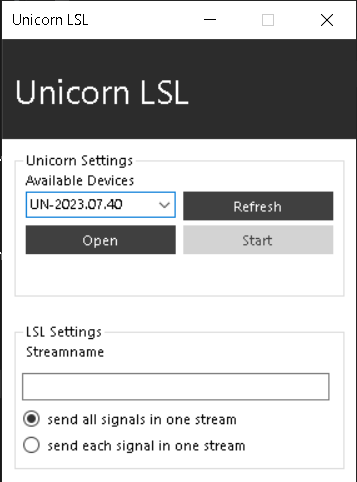
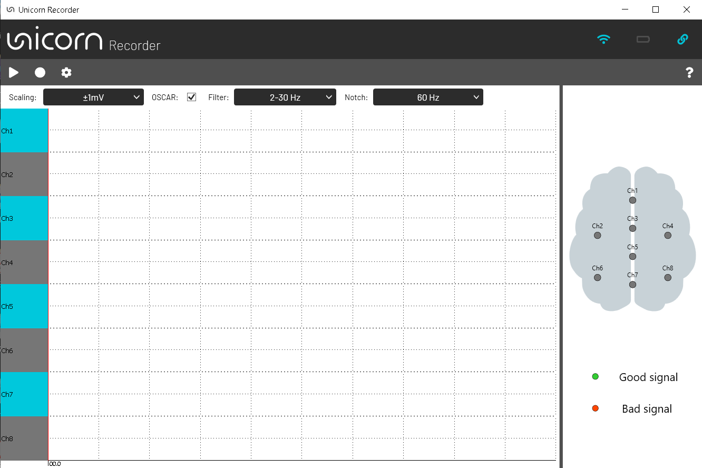

# EEG_UHB

Library for Electroencephalography (EEG) signal acquisition and processing using Unicorn Hybrid Black (UHB) commercial equipment using Lab Streaming Layer (LSL).

## 📑 Contents
- [Install](#install)
  - [Installation from GitHub](#fromGithub)
  - [Installation in virtual environment](#inEnv)
  - [Dependencies](#requirements)
- [Upgrade or Uninstall](#upgrade-uninstall)
- [Use Example](#example)
- [Class EEGAcquisitionManager](#eegacquisitionmanager)
  - [Attributes](#attributes)
  - [Methods](#métodos)
- [License](#license)

## Install <a name="install"></a>

You can install the library directly from PyPI using pip:

```bash
pip install eeg-uhb
```

### Installation from GitHub (optional) <a name="fromGithub"></a>

If you want to install the latest version directly from the repository, run:

```bash
pip install git+https://github.com/IngAmaury/EEG_UHB_LIBRARY.git
```

### Installation in a Python virtual environment <a name="inEnv"></a>

1. Open a terminal or Anaconda Prompt.
2. Create a new virtual environment (for example: myenv):

```bash
python -m venv myenv
```

- Using Anaconda Prompt:

```bash
conda create --name myenv
```

3. Enable the virtual environment:
- Windows:

```bash
myenv\Scripts\activate
```

- Anaconda Prompt:

```bash
conda activate myenv
```

- macOS/Linux:

```bash
source myenv/bin/activate
```

4. Install the library inside the virtual environment:

```bash
pip install eeg-uhb
```

> [!NOTE]
> It is recommended to install in a virtual environment to avoid conflicts with other system libraries.

### Dependencies <a name="requirements"></a>

The library requires the following dependencies, which will be installed automatically with pip:
- numpy
- pylsl
- scipy
- scikit-fuzzy

> [!IMPORTANT]
> If you want to make the acquisition with Unicorn Hybrid Black you need to install [Unicorn Suite Hybrid Black](https://github.com/unicorn-bi/Unicorn-Suite-Hybrid-Black-User-Manual/blob/main/UnicornSuite.md#install-unicorn-suite-hybrid-black), You can also watch their [video tutorial](https://www.youtube.com/watch?v=LOfIr2F7-Tc). Within the application, you will need to install the Unicorn Recorder from the Apps section or the Unicorn LSL from the DevTools section.

## Upgrade or uninstall <a name="upgrade-uninstall"></a>

Already had an older version of the library, you can updated to the latest version with the code:

```bash
pip install --upgrade eeg-uhb
```

If you no longer wish to have the library installed, activate the virtual environment where you installed it and run it:

```bash
pip uninstall eeg-uhb -y
```

## Use example <a name="example"></a>

If you are acquiring through the Unicorn LSL Interface, see the image below, you can use the example code below the image, you must put in the start_adquisition function in the stream_name attribute the same name that you put in the “Streamname” box inside the LSL settings of the Unicorn LSL.

> [!TIP]
> If you have never used the Unicorn LSL Interface before, we recommend that you read its user [documentation](https://github.com/unicorn-bi/Unicorn-Network-Interfaces-Hybrid-Black/blob/main/LSL/unicorn-lsl-interface.md).



```python
from eeg_uhb import EEGAcquisitionManager
import time

if __name__=='__main__':
    EEG = EEGAcquisitionManager()
    start_time = time.time()
    duration = 0.04  # segundos

    '''
    # Connect to any available stream without saving
    eeg.start_acquisition(stream_name='UN-2023.07.40')  

    # Connect to specific stream and save data
    eeg.start_acquisition(stream_name='UN-2023.07.40', 
                        save=True,
                        save_path='./eeg_data/')
    '''
    
    # the stream_name depends on the one you choose
    EEG.start_acquisition(stream_name='UN-2023.07.40', save=True)
    start = time.sleep(duration)
    print(EEG.data)
    print(f'Length: {len(EEG.data)}')
    EEG.stop_acquisition()
```

If you are acquiring through the Unicorn Recorder App, see the image below, you can use the example code below the image, you must not put anything in start_acquisition in the stream_name attribute as the app assigns one internally, the other attributes can be used as normal.



```python
from eeg_uhb import EEGAcquisitionManager
import time

if __name__=='__main__':
    EEG = EEGAcquisitionManager()
    start_time = time.time()
    duration = 0.04  # segundos

    '''
    # Connect stream and save data
    eeg.start_acquisition(save=True, save_path='./eeg_data/')
    '''
    
    # the stream_name depends on the one you choose
    EEG.start_acquisition()
    start = time.sleep(duration)
    print(EEG.data)
    print(f'Length: {len(EEG.data)}')
    EEG.stop_acquisition()
```

## 🧠 Class EEGAcquisitionManager <a name="eegacquisitionmanager"></a>

Initializes the EEG acquisition system.

```python
from eeg_uhb import EEGAcquisitionManager

eeg = EEGAcquisitionManager()
```

### Class attributes <a name="attributes"></a>

| Attributes         | Type       | Description                          |
|------------------|------------|--------------------------------------|
| `channels `      | `float`    | Number of channels in the acquisition.    |
| `data`           | `list`     | Raw EEG samples in format [[first samples per channel], [Second samples per channel], ...]. |
| `fs`             | `float`    | Sampling frequency value            |
| `headers`        | `list`     | List of headers for all possible channels of the 8-channel Unicorn Hybrid Black.|
| `is_recording`   | `bool`     | `True` during acquisition.      |
| `sample_count`   | `int`      | Number of samples acquired.          |
| `start_time`     | `float`    | Time from the beginning of the acquisition in UTC format.      |
| `timestamps`     | `list`     | List of temporary marks by sample list (relative time in utc format).  |

### Class Methods <a name="methods"></a>

Methods within EEGAcquisitionManager Class.

#### `resolve_eeg_stream(name: None | str = None, timeout=1)`

Static method that searches and resolves an EEG data stream available through the **Lab Streaming Layer (LSL)** protocol.

**Parameters:**
- `name` *(None | str)*: Specific name of the EEG stream to search for. If `None`, it will search by default for a stream of type `EEG`.
- `timeout` *(int, opcional)*: Maximum waiting time (in seconds) to resolve the flow (default: 1).

**Return**:
- Returns the EEG stream found or an empty list if none is found.

**Example:**
```python
from eeg_uhb import EEGAcquisitionManager

stream = EEGAcquisitionManager.resolve_eeg_stream()
```

#### `start_acquisition(stream_name = None, save = False, save_path = None)`

Starts EEG data acquisition.

**Parameters:**
- `stream_name` *(None | str)*: Tag that identifies an LSL data stream. (default: `None`).
- `save` *(bool)*: If `True`, saves the data in `save_path`, otherwise it creates a “Data” folder in the current project. (default: `False`)
- `save_path` *(None | str)*: If `True`, serves as path to store the data (default: `None`).

**Return:**
- `True` if the acquisition was started correctly, otherwise `False`.

**Example:**
```python
eeg.start_acquisition(
    save=True,
)
```

#### `stop_acquisition()`
Stops the acquisition and closes open files.

**Example:**
```python
# it is necessary to have used before: start_acquisition()
eeg.stop_acquisition(
    save=True,
)
```

## License <a name="license"></a>

This project is licensed under the Creative Commons Attribution-NonCommercial-ShareAlike 4.0 International License.  
See the LICENSE file for details.

